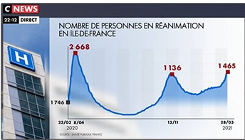
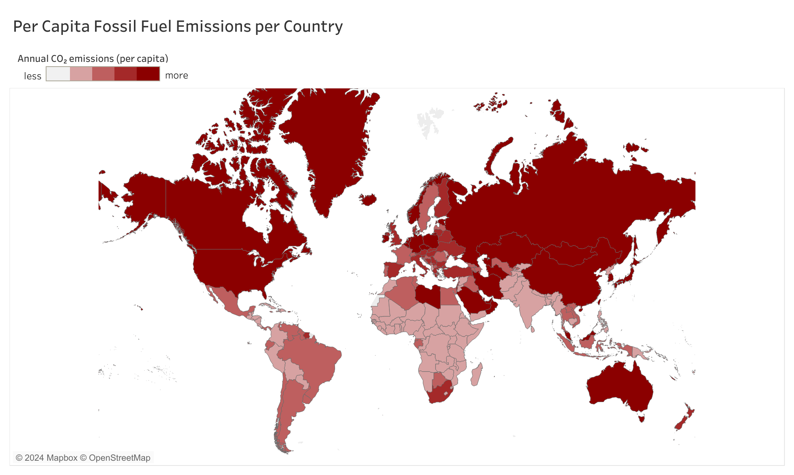
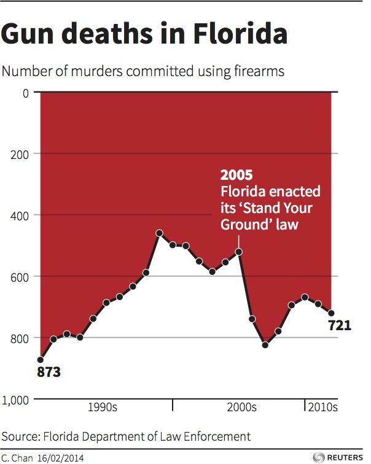

# Cours-Dataviz

Graphique CNews sur la réanimation en Île-de-France : l'axe vertical n'est pas respecté. La valeur 1 746 est placée plus bas que 1 136 et au niveau de 1 465, alors qu'elle est plus élevée. La courbe donne donc l'impression d'une situation qui s'aggrave fortement, ce que les chiffres ne montrent pas.

Carte des émissions de CO² par habitant : l'échelle de couleurs est trompeuse, car même les pays qui n'émettent presque rien sont colorés en rouge clair. À l'inverse, des pays aux émissions très différentes sont tous regroupés dans le même rouge foncé.

Graphique sur les morts par arme à feu en Floride : l'axe vertical est inversé, avec 0 en haut. La hausse des morts après la loi de 2005 ressemble donc à une baisse, et le lecteur comprend l'inverse de la réalité.
