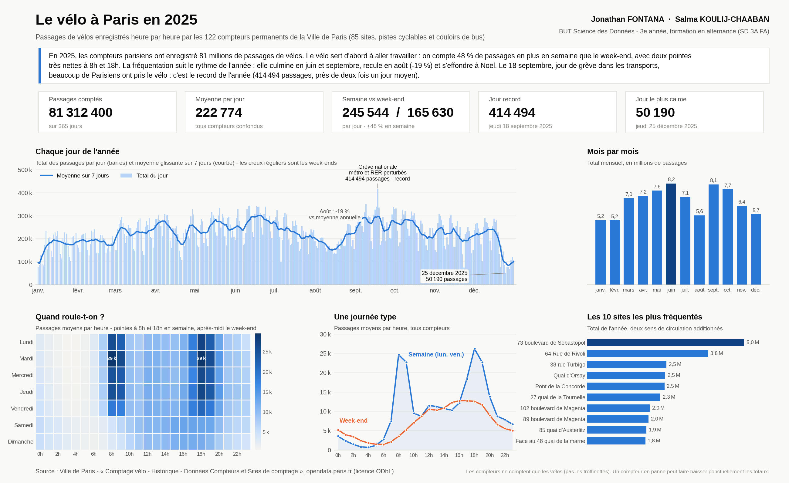

# Le vélo à Paris en 2025

**Jonathan FONTANA · Salma KOULIJ-CHAABAN**
BUT Science des Données - 3e année, formation en alternance (SD 3A FA)

Source : Ville de Paris - [Comptage vélo - Historique - Données Compteurs et Sites de comptage](https://opendata.paris.fr/explore/dataset/comptage-velo-historique-donnees-compteurs/), opendata.paris.fr (licence ODbL).

Fichier utilisé : `2025-comptage-velo-donnees-compteurs.csv` (1,9 Go, environ 1,5 million de relevés horaires). Les compteurs ne comptent que les vélos (pas les trottinettes). Un compteur en panne peut faire baisser ponctuellement les totaux.
